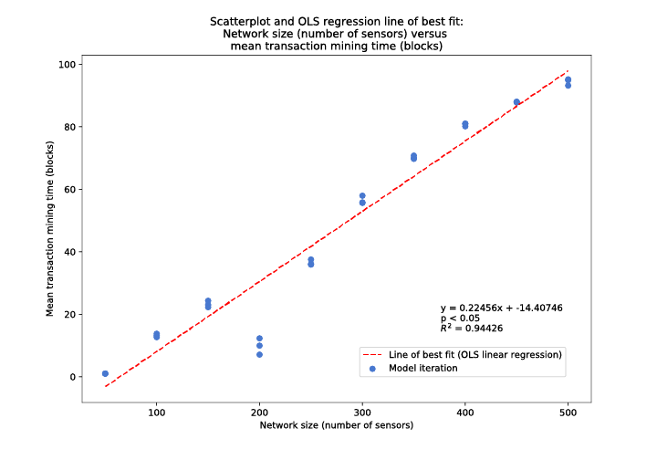

# Sovereign sensors

> Objects exist in space. These entities interact over time.

This repository holds my MSc dissertation — *Sovereign Sensors: an investigation of factors pertaining to the governance of informational resources in the context of decentralization* (UCL Bartlett Centre for Advanced Spatial Analysis, 2018–19) — together with the agent-based model built for it, a hardware/smart-contract prototype concept, and the proposals and notes produced along the way.

The question underneath the work: how should we govern machines that sense, record and act in physical space? In 2019 my vocabulary for that question was the Internet of Things, blockchains and DAOs. The mechanisms I proposed — machine identity rooted in trusted hardware, devices participating directly in governance protocols, treaty verification built on signed evidence from sensors in the field — have since become central themes in technical AI governance, from hardware-enabled governance mechanisms and compute governance to the verification problems posed by autonomous weapons systems. This repository preserves that thinking as it was written.

## Abstract

> As connected sensors capture and process ever greater amounts of information about their local vicinities, growing networks of these devices create the potential for improving situational awareness and, therefore, the efficiency and virtue of resource management. However, due to the technical, commercial and legal realities of these systems in the present day, much of the informational value these networks represent to humanity remains unaccessed. Concurrently, advancements in information technologies — especially cryptography — are enabling the emergence of a decentralized web paradigm designed to preserve individual autonomy and privacy. [...] This dissertation seeks to identify and define concepts key to connected sensor networks and the decentralized web. The fundamentals of enabling technologies including computing, cryptography and digital communication are reviewed, and relevant decentralized technologies such as smart contracts, decentralized autonomous organizations, content-based addressing, self-sovereign identities and Ricardian contracts are defined. An agent-based model simulating the operation of connected sensors connecting to a public blockchain network was developed; quantitative results of parameter sweeps of three input parameters are reported and analyzed. Considerations concerning the connection of edge sensors with smart contracts are presented. The technical and political feasibility and ethics of high impact applications of such systems are discussed.

The full text is in [`dissertation/`](dissertation/). The digital submission's IPFS hash — `QmZyCNozTzYdVk2Ngn3gzpYoSVSchdUP1CnJG6T2K9Fic5` — is printed on the cover page; registering the document against a content hash was itself a small demonstration of the thesis.

## The argument

Three ideas run through the work.

**Machines with cryptographic identity.** From the dissertation proposal:

> We intend to investigate the technical feasibility of endowing these secure connected sensors with private keys inaccessible to other informational entities (i.e. humans or computers), thereby providing them a functional cryptographic identity. The implications of this form of machine-controlled externally-owned account may be quite significant as, within the appropriate public key infrastructure, it could assure the integrity, confidentiality and non-repudiability of data transmitted by such a sensor. This system would allow such sensors to sign transactions calling smart contract functions, enabling direct participation of machine / software agents in the governance processes of decentralized autonomous organizations, where they might serve as a type of empirical oracle.

**Ricardian treaties.** The high-impact application argued for in the Discussion is machine-verified arms control:

> [I imagine] an agreement between sovereign nations — a valid, legal treaty — that expressly delegates some authority to a smart contract. Contract code would be open to inspection by all. Parties could be required to submit digitally-signed evidence of treaty compliance; violation of terms would automatically trigger agreed-upon enforcement mechanisms.
>
> Arms control represents a particularly high impact application of this system of oversight.

The original proposal put the aim more bluntly: "to contribute to the development of a way to ensure that each weapon is tracked and traced and only used by authorized individuals in authorized contexts, thereby reducing the availability of weapons for use by non-state and illicit actors."

**Governance tested in simulation before deployment.** Rather than argue the system design purely on principle, the dissertation builds an agent-based model of sensors syncing to a public blockchain and measures how the system behaves as it scales. The result was partly negative, and reported as such:

> Sensors embedded on devices generate large quantities of data. At first glance, blockchains do not seem a sensible informational architecture to store or compute IoT data. This intuition was validated by the observation of diminishing informational currency measures and increasing costs associated with increasing network loads.

## The model

The model, built with [Mesa](https://github.com/projectmesa/mesa), simulates a network of battery-constrained sensors that record observations of their environment, sign them, and pay gas to write them to a simulated public blockchain with a mempool, block gas limits and probabilistic mining. Parameter sweeps vary three independent variables — network size, record volume (bytes) and record frequency — and measure three dependent variables: mean transaction mining time, gwei spent per sensor, and "informational currency," a measure of how current the on-chain record is relative to the state of the world it describes.



Model code is in [`model/SensorBlockchainNetwork/`](model/SensorBlockchainNetwork/); the run and analysis notebooks are [`model/blockchain-model.ipynb`](model/blockchain-model.ipynb) and [`model/SensorBlockchainNetwork-analyze.ipynb`](model/SensorBlockchainNetwork-analyze.ipynb). The final batch-run data reported in the dissertation is committed in `model/data/final/`, and the generated figures in `model/outputs/figures/`.

### Running it

The model predates modern Python; a Dockerfile recreates its 2019 environment (Python 3.6, Mesa 0.8.5) so the notebooks run as written:

```sh
cd model
docker build -t sovereign-sensors-model .
docker run --rm -p 8888:8888 sovereign-sensors-model
```

Then open http://localhost:8888. `SensorBlockchainNetwork-analyze.ipynb` reproduces the dissertation's results from the committed data in `data/final/`; `blockchain-model.ipynb` runs the model itself. (The image is `linux/amd64` — on Apple Silicon it runs under emulation, slowly but correctly.)

## Reading it in 2026

I finished this dissertation in September 2019. Since then, several of its threads have moved from the periphery of the discourse toward its center:

- **Hardware roots of trust as governance instruments.** The dissertation's core mechanism — a private key generated and held inside trusted hardware, so a physical device can make non-repudiable claims about what it observed — is the same primitive now proposed for compute governance and hardware-enabled AI governance: on-chip attestation, location verification, workload claims.
- **Verification between adversaries.** The treaty-verification argument, including its pointer to zero-knowledge warhead verification (Glaser et al.), anticipates a live problem in AI arms control: how mutually distrusting states can verify claims about each other's systems without disclosing the systems themselves.
- **Governing machines as spatial actors.** The dissertation treats a machine as an entity that exists at a location, observes its vicinity, and carries an identity that travels with it through space — and asks how rules can be attached to that. That framing, more than any particular technology in the text, is the thread I have kept pulling: autonomous systems are spatial actors, and governing them requires infrastructure that knows where they are and what they are permitted to do there.

The text is a 2019 document and reads like one. The instruments I reached for were the decentralized web's, and some of those bets have aged better than others; the questions have aged better than the answers. I have deliberately left everything as written — including the proposals, which wander at times into speculative philosophy — because the honest record is more useful than a retouched one.

## Repository map

| Path | Contents |
|---|---|
| `dissertation/` | Final submission PDFs and the markdown chapter outlines they grew from |
| `model/` | The Mesa agent-based model: package, notebooks, ODD protocol draft, final run data, figures, Dockerfile |
| `prototype/` | Concept prototype for smart shipping containers: Solidity `DeviceRegistry`, device-side pseudocode and notes |
| `proposals/` | The dissertation proposals as drafted and submitted, including the original arms-control framing |
| `visualizations/` | Supporting figures on Bitcoin difficulty and Ethereum block times and gas |
| `notes/` | Working notes: the ABM design outline and a June 2019 note on framing the research |

The unabridged working history — draft snapshots, intermediate model runs, scratch notebooks — is preserved on the [`archive/working-files`](../../tree/archive/working-files) branch.

## Citation

> John Robison Hoopes, *Sovereign Sensors: an investigation of factors pertaining to the governance of informational resources in the context of decentralization*, MSc dissertation, UCL Bartlett Centre for Advanced Spatial Analysis, 2019.

More of my current work on the spatial governance of intelligent machines is at [johnx.co](https://johnx.co).
